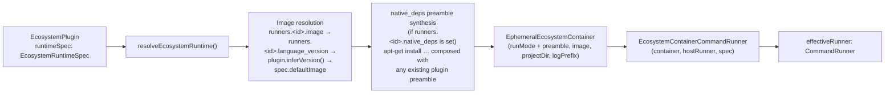

# Ecosystem Runtime Container

`src/infrastructure/ecosystem-runtime/` is the unified seam through which a plugin's CLI runs in an ephemeral Docker container. One module replaces what used to be three triplicated runner trios (executor + resolver + provisioner). See [ADR 0001](/adr/0001-docker-only-runtime.md) for the docker-only decision.



## EcosystemRuntimeSpec

Declarative description of how an ecosystem's CLI runs in a container. Lives on the plugin as `runtimeSpec`:

```ts
interface EcosystemRuntimeSpec {
  defaultImage: string;
  resolveImage: (version: string | undefined) => string;
  containerBinaries: readonly string[];
  runMode: RunMode;
}

type RunMode =
  | { kind: 'direct-exec'; binary: string; preamble?: (image: string) => string | undefined }
  | { kind: 'shell-wrap'; preamble?: (image: string) => string | undefined };
```

## Run Modes

| `runMode.kind` | Used by | Final docker invocation |
|---|---|---|
| `direct-exec` (no preamble) | npm | `docker run <image> <binary> <args...>` |
| `direct-exec` (with preamble) | npm + `native_deps` | `docker run <image> sh -lc '<preamble> && exec "$@"' -- <binary> <args...>` |
| `shell-wrap` | pip, composer | `docker run <image> sh -lc "[<preamble> && ]<args joined>"` |

Both run modes support an optional `preamble` function. It is consulted per invocation with the resolved image and may return `undefined` to skip injection for that specific image.

- **`shell-wrap` preamble** — used by composer to inject `COMPOSER_BOOTSTRAP` when the image is a bare `php:*-cli` that does not pre-install composer.
- **`direct-exec` preamble** — used when `native_deps` is configured in `runners.npm` (or `pip`/`composer`). `resolveEcosystemRuntime` synthesizes an `apt-get install` preamble and injects it before the binary. When a preamble is present, the executor switches to `sh -lc '…' -- binary args`, preserving the SEC-004 trust boundary: original argv tokens remain independent shell word elements via `"$@"` and are never re-tokenized.

When both a `native_deps` preamble (from config) and a plugin preamble (from `runtimeSpec`) are present, `resolveEcosystemRuntime` composes them: `<native_deps_apt_cmd> && <plugin_preamble>`.

`runShell()` always uses `sh -c` (without `-l`), preserving legacy behavior for arbitrary user-supplied validation commands.

## Routing

`EcosystemContainerCommandRunner` routes commands by inspecting the binary against `spec.containerBinaries`:

| Command class | Example | Routed to |
|---|---|---|
| Spec-recognized binary | `runner.runArgs('npm', ['install'])` | Ephemeral container |
| Other CLI command | `runner.run('jest --coverage')` | Container via `runShell()` |
| Host-only command | `runner.runArgs('git', ['push'])` | Host runner |

**Host-only commands** are `git`, `gh`, `open`. They never enter the container regardless of which spec is active.

Advisor commands are ecosystem commands and always use this resolved runner,
including when the fix phase has no applicable dependency updates. The
no-advisor path may skip runtime resolution because no ecosystem command will
run. See [BDR 0001](/bdr/0001-advisors-use-ecosystem-runtime.md).

## Adding a new ecosystem (runtime side)

For a hypothetical `cargo` plugin:

```ts
// src/modules/ecosystem/plugins/cargo.ts
runtimeSpec: {
  defaultImage: 'rust:latest',
  resolveImage: (v) => v ? `rust:${v}` : 'rust:latest',
  containerBinaries: ['cargo'],
  runMode: { kind: 'direct-exec', binary: 'cargo' },
},
```

That declaration alone wires the entire runtime chain — no new provisioner class, no new executor class, no orchestrator edits.
