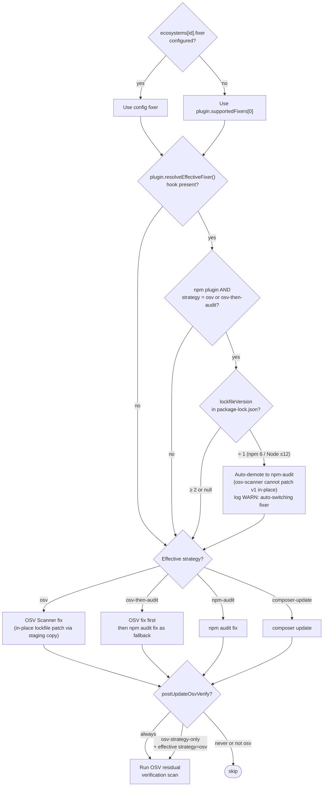

# Fixer Strategy Decision Tree

The effective fixer strategy is resolved before any mutation begins. The base strategy comes from config or the plugin default; per-plugin hooks may then override it. For npm, `NpmPlugin.resolveEffectiveFixer(config, cwd)` encapsulates the lockfile-v1 demotion logic — `runEcosystemFix` calls the hook rather than applying npm-specific special-cases inline.

