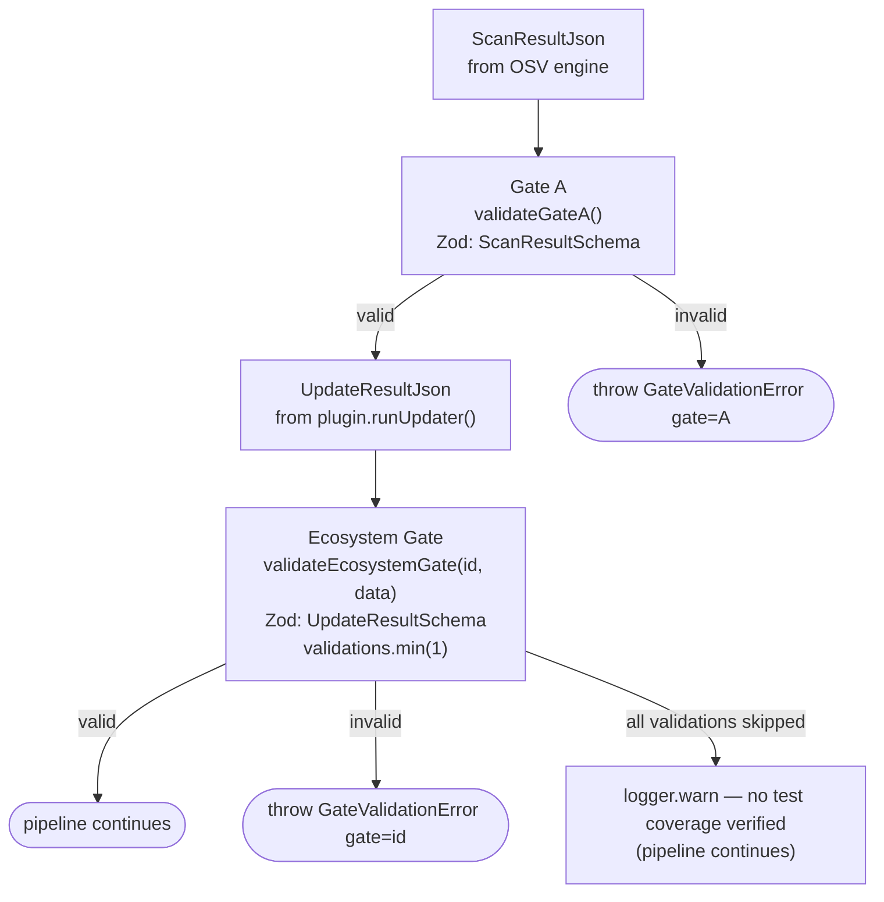
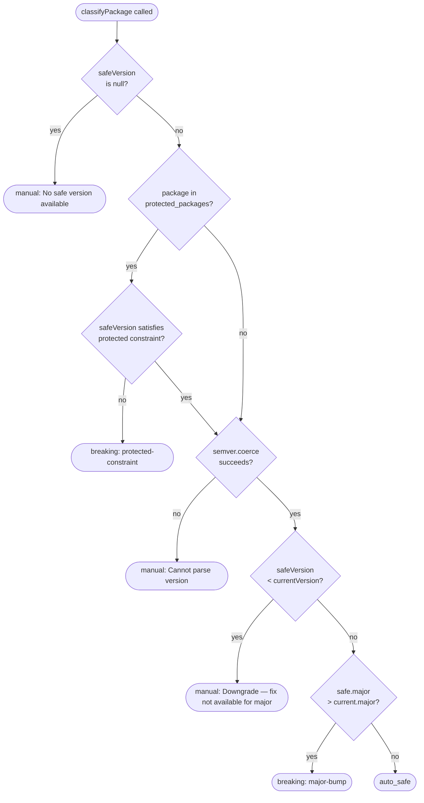

# Gates and Safe-Update Policy

The pure-domain validation layer: every phase output passes a Zod gate, and every vulnerable package is classified before any fix.

## Gate System

**Key constraint:** `validations` array must always have at least one entry. When tests are not run (e.g., dry-run), emit a `{ name: ..., status: 'skipped' }` entry. An empty array fails the gate.

## Safe-Update Classification

`core/policy/safe-update.ts:classifyPackage()` evaluates every vulnerable package against semver rules and the project's `protected_packages` config.

