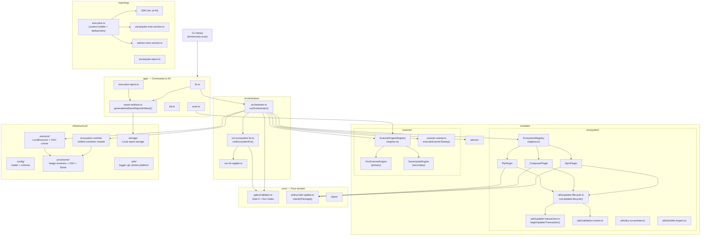

# High-Level Architecture

What the major components are and how they connect. Consult first when onboarding; each subgraph has its own detailed view in this directory.

```mermaid
graph TD
    CLI["CLI binary<br/>(bin/security-scan)"]

    subgraph app["app/ — Commands & I/O"]
        FIX["fix.ts"]
        SCAN["scan.ts"]
        INIT["init.ts"]
        EXEC_RPT["executive-report.ts"]
        RPT_ART["report-artifacts.ts<br/>generateAndSaveReportArtifacts()"]
    end

    subgraph orchestration["orchestration/"]
        ORCH["orchestrator.ts<br/>runOrchestrator()"]
        RUN_ECO_FIX["run-ecosystem-fix.ts<br/>runEcosystemFix()"]
        OSV_FIX["osv-fix-applier.ts"]
    end

    subgraph modules["modules/"]
        subgraph ecosystem["ecosystem/"]
            ECO_REG["EcosystemRegistry<br/>(registry.ts)"]
            NPM_P["NpmPlugin"]
            COMP_P["ComposerPlugin"]
            PIP_P["PipPlugin"]
            UPDATER_LC["utils/updater-lifecycle.ts<br/>runUpdaterLifecycle()"]
            UPDATER_TX["utils/updater-transaction.ts<br/>beginUpdaterTransaction()"]
            VAL_RUN["utils/validation-runner.ts"]
            DRY_PREV["utils/dry-run-preview.ts"]
            LOCK_INS["utils/lockfile-inspect.ts"]
        end
        subgraph scanner["scanner/"]
            SCAN_REG["ScannerEngineRegistry<br/>(registry.ts)"]
            OSV_E["OsvScannerEngine<br/>(primary)"]
            SONAR_E["SonarQubeEngine<br/>(secondary)"]
            SCANNER_SWEEP["scanner-sweep.ts<br/>executeScannerSweep()"]
        end
        ADVISOR["advisor/"]
    end

    subgraph core["core/ — Pure domain"]
        GATE["gates/validator.ts<br/>Gate A + Eco Gates"]
        POLICY["policy/safe-update.ts<br/>classifyPackage()"]
        TYPES["types/"]
    end

    subgraph infra["infrastructure/"]
        CONFIG["config/<br/>loader + schema"]
        ECO_RT["ecosystem-runtime/<br/>Unified container module"]
        EXEC_WRAP["executor/<br/>LocalExecutor + OSV runner"]
        PROV["provisioner/<br/>Image resolvers + OSV + Sonar"]
        STORAGE["storage/<br/>Local report storage"]
        UTILS["utils/<br/>logger, git, docker-platform"]
    end

    subgraph reporting["reporting/"]
        RPT["executive.ts<br/>(context builder + dedupVulns)"]
        SONAR_SEC["sonarqube-exec-section.ts"]
        ADV_SEC["advisor-exec-section.ts"]
        SONAR_RPT["sonarqube-report.ts"]
        I18N["i18n/ (en, pt-br)"]
    end

    CLI --> app
    FIX --> ORCH
    FIX --> RPT_ART
    EXEC_RPT --> RPT_ART
    SCAN --> SCAN_REG
    ORCH --> ECO_REG
    ORCH --> SCAN_REG
    ORCH --> SCANNER_SWEEP
    ORCH --> GATE
    ORCH --> ADVISOR
    ORCH --> RUN_ECO_FIX
    RUN_ECO_FIX --> OSV_FIX
    RUN_ECO_FIX --> GATE
    NPM_P --> UPDATER_LC
    COMP_P --> UPDATER_LC
    PIP_P --> UPDATER_LC
    UPDATER_LC --> UPDATER_TX
    UPDATER_LC --> VAL_RUN
    ECO_REG --> NPM_P
    ECO_REG --> COMP_P
    ECO_REG --> PIP_P
    SCAN_REG --> OSV_E
    SCAN_REG --> SONAR_E
    NPM_P --> POLICY
    COMP_P --> POLICY
    PIP_P --> POLICY
    ORCH --> ECO_RT
    ORCH --> EXEC_WRAP
    ECO_RT --> PROV
    EXEC_WRAP --> PROV
    RPT --> I18N
    RPT --> SONAR_SEC
    RPT --> ADV_SEC
    RPT_ART --> STORAGE
```
