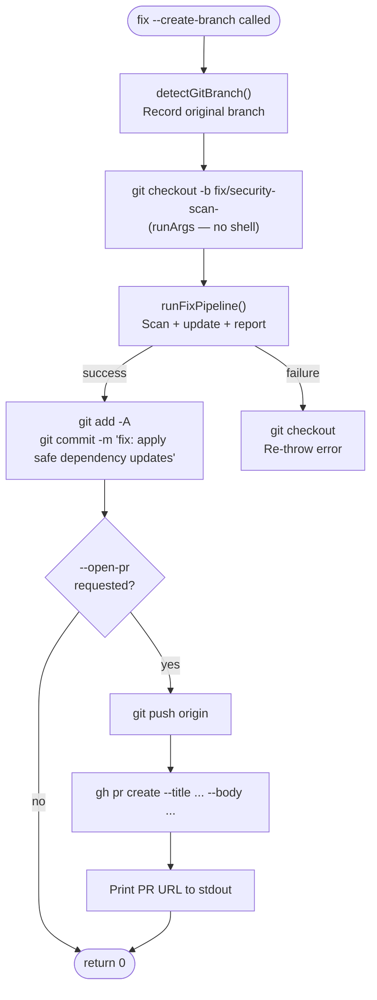

# Operational Flows — Git/PR Workflow and Production Hardening

## Git/PR Workflow

`src/infrastructure/utils/git-commit.ts` provides the transactional branch+commit wrapper used by `fix.ts` when `--create-branch` or `--open-pr` is requested.



**Key invariant:** `git checkout -b <branchName>` always uses `runner.runArgs('git', ['checkout', '-b', branchName])` — never string interpolation — because branch names are external data that may contain shell metacharacters.

## Production Hardening

### Retry with backoff

`src/infrastructure/utils/retry.ts` exports `withRetry<T>(fn, opts)` — wraps all four Docker provisioner `run()` calls. Default: 3 attempts, 1s/2s/4s exponential backoff.

Retry triggers only on transient Docker errors (`docker pull`, `network timeout`, `connection refused`, `exit code 125`). Gate failures and business logic errors are never retried.

### Validation command timeouts

`ValidationCommandConfig.timeout_seconds` defaults to `300` (5 min) when not specified. Commands that hang past the limit are killed and reported as failed.

### Config versioning

`config_version: "1"` is an optional field in `security-scan.config.json`. Unsupported versions produce a user-friendly error:

```
Unsupported config_version "2". This version of security-scan supports config_version "1".
Run "security-scan init --force" to regenerate a compatible config.
```
