# Orchestrator Pipeline Flow

The `runOrchestrator()` function in `orchestration/orchestrator.ts` owns the full `fix` pipeline. Phase selection lives in the **Phase Router** (`src/orchestration/phase-router.ts`, [ADR 0010](/adr/0010-phase-router-extraction.md)): `resolveExecutionPlan(config, options, registry)` is pure (no I/O, no Docker) and returns the `ExecutionPlan` (`runScan`, `activeEcosystems`, `runReport`, `onFailureFor`) that the orchestrator executes. The per-entry body is delegated to `runEcosystemFix()` (`src/orchestration/run-ecosystem-fix.ts`); the orchestrator runs advisors, dispatches, and aggregates.

```mermaid
flowchart TD
    START([runOrchestrator called]) --> PLAN

    PLAN["resolveExecutionPlan()\nphase-router.ts — pure\nExecutionPlan: runScan, activeEcosystems,\nrunReport, onFailureFor (ADR 0010)"]
    PLAN --> PRE_SNAP

    PRE_SNAP["Take pre-run snapshots\npackage.json + package-lock.json"]
    PRE_SNAP --> PHASE_CHECK

    PHASE_CHECK{"plan.runScan?"}
    PHASE_CHECK -- no --> SKIP_SCAN([return: status=skipped])
    PHASE_CHECK -- yes --> ENGINES

    ENGINES["Run all scanner engines\n(OSV primary + SonarQube secondary)"]
    ENGINES --> GATE_A

    GATE_A{"Gate A\nvalidation\n(Zod)"}
    GATE_A -- fail --> GATE_ERR([throw GateValidationError])
    GATE_A -- pass --> KILL_SW

    KILL_SW{"SECURITY_SCAN_NO_AUTO_FIX\nenv var set?"}
    KILL_SW -- yes --> RETURN_SCAN([return scan result only])
    KILL_SW -- no --> PLUGINS

    PLUGINS["Iterate config.ecosystems entries\n(each entry has id + optional path + optional label)\nentryKey = id or id:label"]
    PLUGINS --> PHASE_PLUGIN

    PHASE_PLUGIN{"entry phase enabled?\naccepts bare id OR entryKey\nnpm runs all npm entries\nnpm:frontend runs only that entry"}
    PHASE_PLUGIN -- no --> NEXT_PLUGIN
    PHASE_PLUGIN -- yes --> ADVISORS

    ADVISORS["Run advisors<br/>(informational, never blocks)"]
    ADVISORS --> RUN_ECO_FIX

    subgraph runEcosystemFix["runEcosystemFix() — src/orchestration/run-ecosystem-fix.ts"]
        direction TB
        RUN_ECO_FIX([runEcosystemFix called]) --> HAS_UPDATES

        HAS_UPDATES{"auto_safe vulns > 0<br/>or breaking vulns + authorized?"}
        HAS_UPDATES -- no --> SKIPPED([return: status=skipped])
        HAS_UPDATES -- yes --> RESOLVE_RUNNER

        RESOLVE_RUNNER["Resolve effective runner<br/>via Ecosystem Runtime Container<br/>(includes native_deps preamble)"]
        RESOLVE_RUNNER --> LOCK_DEMOTE

        LOCK_DEMOTE{"npm + osv/osv-then-audit<br/>+ lockfileVersion=1?"}
        LOCK_DEMOTE -- yes --> AUTO_DEMOTE["Auto-demote fixer → npm-audit\n(osv-scanner cannot patch v1 lockfiles)"]
        LOCK_DEMOTE -- no --> OSV_STAGING
        AUTO_DEMOTE --> OSV_STAGING

        OSV_STAGING["OSV staging-fix<br/>(if effective strategy=osv or osv-then-audit)"]
        OSV_STAGING --> DRY_PREVIEW

        DRY_PREVIEW["Dry-run preview<br/>(if --dry-run)"]
        DRY_PREVIEW --> RUN_UPDATER

        RUN_UPDATER["plugin.runUpdater()<br/>via runUpdaterLifecycle()"]
        RUN_UPDATER --> BREAKING

        BREAKING{"authorizeBreaking<br/>+ plugin.installBreakingPackages?"}
        BREAKING -- yes --> INSTALL_BREAKING["Install breaking packages"]
        BREAKING -- no --> OSV_VERIFY
        INSTALL_BREAKING -- error --> ABORT_BREAKING([return: status=error])
        INSTALL_BREAKING -- ok --> OSV_VERIFY

        OSV_VERIFY{"postUpdateOsvVerify<br/>policy?"}
        OSV_VERIFY -- "always or osv-strategy-only<br/>(when strategy=osv)" --> RUN_VERIFY["Run OSV residual<br/>verification scan"]
        OSV_VERIFY -- never --> ECO_GATE
        RUN_VERIFY --> ECO_GATE

        ECO_GATE{"Ecosystem gate<br/>validation (Zod)"}
        ECO_GATE -- fail --> GATE_ERR2([throw GateValidationError])
        ECO_GATE -- pass --> SUCCESS_OR_ERR

        SUCCESS_OR_ERR{"updateResult.status<br/>= error?"}
        SUCCESS_OR_ERR -- yes --> RET_ERR([return: status=error])
        SUCCESS_OR_ERR -- no --> RET_SUCCESS([return: status=success])
    end

    SKIPPED --> NEXT_PLUGIN
    RET_SUCCESS --> NEXT_PLUGIN
    RET_ERR --> PIPELINE_STOP([stop pipeline, set overallStatus=error])
    ABORT_BREAKING --> PIPELINE_STOP

    NEXT_PLUGIN{more\nentries?}
    NEXT_PLUGIN -- yes --> PHASE_PLUGIN
    NEXT_PLUGIN -- no --> PENDING

    PENDING["Check hasPendingVulns\n(breaking or manual vulns remain)"]
    PENDING --> DONE([return OrchestratorResult])
```



## Per-Ecosystem Fix Flow (`runEcosystemFix`)

`src/orchestration/run-ecosystem-fix.ts` encapsulates the per-entry sub-pipeline that the orchestrator dispatches to once per `config.ecosystems` entry. The orchestrator owns: phase filtering, advisors, fan-out across entries, and result aggregation. Everything between "we're about to process entry X" and "X returned an outcome" lives in `runEcosystemFix`. When the entry carries a `path` field, the orchestrator resolves it relative to the project root and passes the resulting absolute path as `cwd` — so all Docker volumes and runtime commands operate in the correct subdirectory.

```ts
export type RunEcosystemFixOutcome =
  | { status: 'skipped'; reason: 'no-updates' }
  | { status: 'success'; updateResult: UpdateResultJson; residualVerification?: ResidualVerification }
  | { status: 'error'; updateResult: UpdateResultJson };
```

**Why the seam exists:** before this extraction, the orchestrator's plugin loop body was ~193 lines mixing 15 distinct concerns. Tests of any single concern required full orchestrator setup (registry, scanner engines, Gate A wiring). After extraction, `runEcosystemFix` is testable directly with fake plugins — no scanner, no orchestrator. See `tests/unit/orchestration/run-ecosystem-fix.test.ts`.

**Throws** `GateValidationError` when the ecosystem gate fails. Otherwise always returns an outcome — including the breaking-install short-circuit, which returns `'error'` without running residual verification or gate validation (mirroring legacy semantics).
