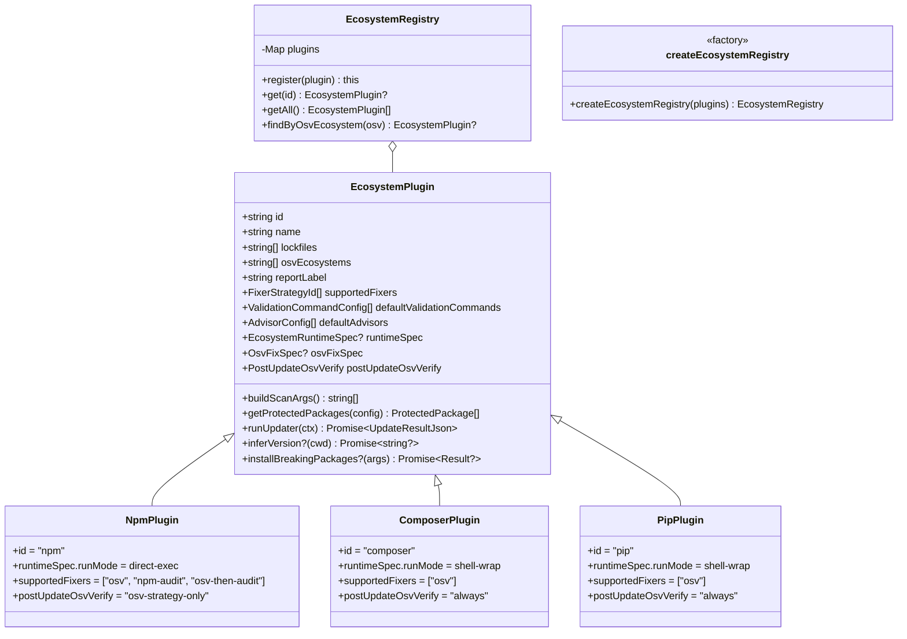

# Plugin System (EcosystemPlugin)

Each package manager is a plugin that implements the `EcosystemPlugin` interface (`modules/ecosystem/types.ts`).

**Adding a new ecosystem:**

1. Create `src/modules/ecosystem/plugins/<name>.ts` implementing `EcosystemPlugin`.
2. Declare a `runtimeSpec: EcosystemRuntimeSpec` on the plugin object — see [Ecosystem Runtime Container](ecosystem-runtime.md) for the spec shape.
3. Add the plugin to the declarative list in `src/modules/ecosystem/index.ts`: `defaultRegistry = createEcosystemRegistry([npmPlugin, composerPlugin, pipPlugin, <newPlugin>])` ([ADR 0009](/adr/0009-explicit-ecosystem-registry-factory.md)). Array order = phase order. Tests build isolated registries via `createEcosystemRegistry([fake])` — no side-effect bootstrap.

No new files in `infrastructure/`, no orchestrator edits. The unified runtime module reads `runtimeSpec` and wires the entire container chain.
