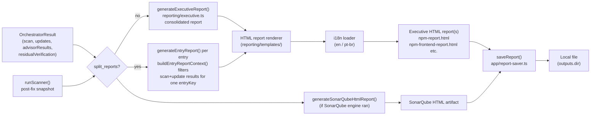
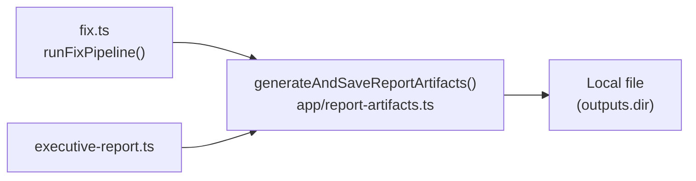

# Reporting — Generation Flow and Artifacts

## Report Generation Flow



## Split Reports

When `outputs.split_reports: true` (config) or `--split-reports` (CLI flag) is set, the report layer generates one HTML report per ecosystem entry instead of a consolidated report:

- `buildEntryReportContext(entry, orchestratorResult)` filters the full result set down to only the scan data and update result for that single `entryKey`.
- `splitReportFilename(entry)` derives the output filename from the entry: `npm-report.html` for bare-id entries, `npm-frontend-report.html` for labelled entries (label is derived from `entry.label`).
- Each split report is self-contained with the same HTML template and i18n locale as the consolidated report.
- The CLI `--split-reports` flag takes precedence over `outputs.split_reports` in the config file.

**Report label format:** when an entry has a label, the report displays it as `npm (frontend)` — the plugin id followed by the label in parentheses. This mirrors the `ecosystemEntryKey` composite key format but in a human-readable form.

## Report Artifacts

`src/app/report-artifacts.ts` centralizes post-pipeline artifact generation that was previously duplicated between `fix.ts` and `executive-report.ts`.

```ts
interface ReportArtifactsInput {
  orchestratorResult: OrchestratorResult;
  config: ProjectConfig;
  cwd: string;
  runner: CommandRunner;
  // … locale, formats, outputDir, etc.
}

async function generateAndSaveReportArtifacts(input: ReportArtifactsInput): Promise<void>
```

Both `fix.ts` (`runFixPipeline`) and `executive-report.ts` delegate their entire report generation phase to this single function. The scan-after snapshot (post-fix OSV scan for residual verification display) is orchestrated internally. `writeAuditTrail()` is intentionally kept in `fix.ts` rather than here — the audit trail is a run-level record, not a report artifact.


