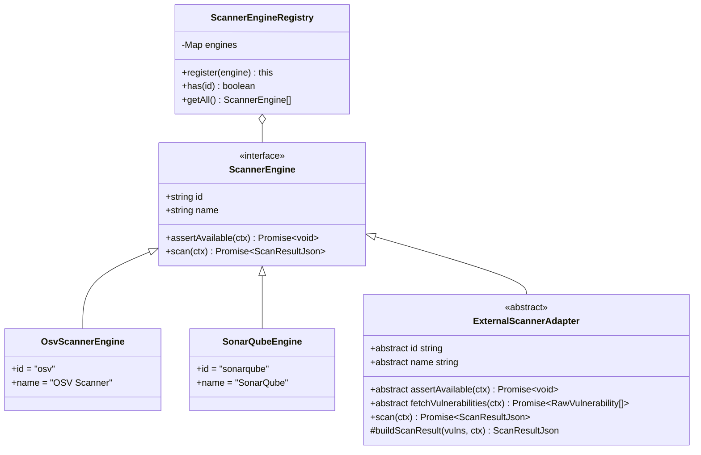
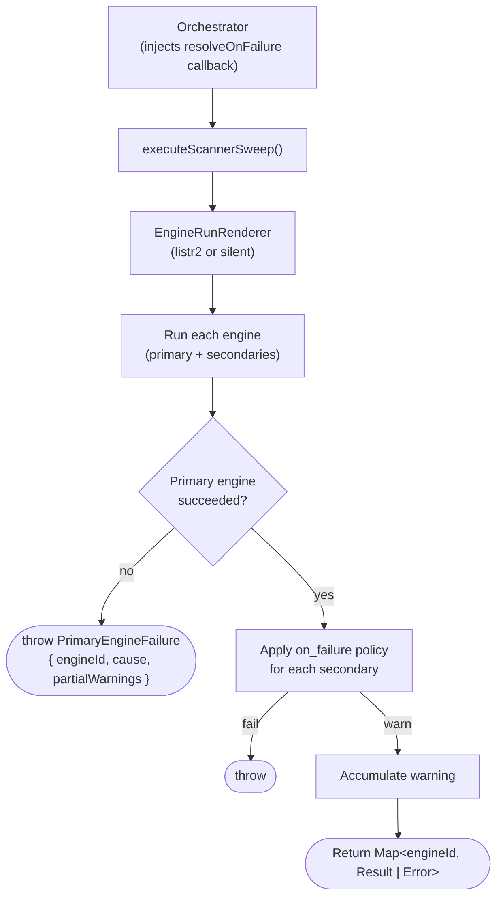

# Scanner System — Engines, Sweep, N-Scan

How scanning works: the engine abstraction, the multi-engine sweep stage, and the per-entry OSV scan that makes monorepos collision-free.

## Scanner Engine System

**Primary vs secondary engine:**

- **Primary** = engine whose `id` matches `config.scanners.primary` (defaults to `'osv'` when not configured). Its result drives Gate A. Any failure is fatal.
- **Secondary** = all other registered engines. Failures are governed by `on_failure: 'warn' | 'fail'` (default: `'warn'` for SonarQube, `'fail'` for unknown engines).

## Scanner Sweep

`src/modules/scanner/scanner-sweep.ts` encapsulates the multi-engine scan stage that was previously inlined in `runOrchestrator()`. It runs all registered scanner engines, classifies results into entries vs warnings, and applies the `on_failure` policy for secondary engines.

**Key design points:**

- **Config-agnostic:** the `resolveOnFailure` policy resolver is injected as a callback by the orchestrator, keeping the sweep module free of config imports.
- **Renderer-agnostic:** an `EngineRunRenderer` adapter controls visual presentation. Two implementations: `listr2ScannerSweepRenderer` (builds a Listr2 task list with progress, used in interactive mode) and `silentScannerSweepRenderer` (sequential, no UI — used in tests and JSON-output mode).
- **`PrimaryEngineFailure`:** typed exception thrown when the primary engine fails. Carries `{ engineId, cause, partialWarnings }`. `partialWarnings` preserves any warnings already accumulated from secondary engines that ran before the primary failed — they are forwarded in error diagnostics rather than discarded.

## N-Scan Architecture (Per-Entry OSV Scanning)

`OsvScannerEngine` runs one `osv-scanner` invocation per `config.ecosystems` entry rather than a single combined scan. This avoids cross-entry collision when multiple entries share the same plugin id (e.g. two `npm` entries in a monorepo).

### How it works

1. **Entry iteration** — the engine loops over `config.ecosystems` in declaration order. For each entry it resolves the plugin and computes the `entryKey` via `ecosystemEntryKey(entry)`.
2. **Path-aware lockfile args** — the plugin's `buildScanArgs()` produces a list of `--lockfile <file>` pairs relative to the project root. When the entry has a `path` field (monorepo subdirectory), the engine rewrites each `--lockfile` arg by prepending `entry.path` (e.g. `--lockfile frontend/package-lock.json`).
3. **Single scan helper** — `runSingleScan(rawArgs, useDocker, ...)` encapsulates the Docker or local runner invocation. Both paths share identical output parsing.
4. **Re-keying** — `parseOsvJsonOutput()` keys results by `plugin.id`. After parsing, the engine re-keys each result to `entryKey` and updates `VulnerabilityEntry.ecosystem` to the composite key. This means downstream consumers (orchestrator, report builder, residual-verification) receive results already keyed by `entryKey` format, not by bare `plugin.id`.
5. **Merged output** — all per-entry results are merged into a single `ScanResultJson.ecosystems` map keyed by `entryKey` (e.g. `{ npm: ..., 'npm:frontend': ..., composer: ... }`).

### ecosystemEntryKey convention

`ecosystemEntryKey(entry)` in `src/core/types/config.ts` derives a unique string key for each ecosystem config entry:

- `<id>` — when the entry has no label (single-plugin entries): e.g. `npm`, `composer`, `pip`
- `<id>:<label>` — when the entry has a label (monorepo multi-entry): e.g. `npm:frontend`, `npm:backend`, `pip:api`

The colon separator is chosen because it is invalid in plugin ids and labels, making the key unambiguous and parseable back into its components.

### Entry-keyed pipeline

Once per-entry scan results exist, the entire downstream pipeline uses `entryKey` as the primary key:

| Stage | Keying |
|---|---|
| Scan results (`ScanResultJson.ecosystems`) | `entryKey` |
| Update results (`OrchestratorResult.updates`) | `entryKey` |
| Advisor results (`OrchestratorResult.advisorResults`) | `entryKey` |
| Residual verification summary | `entryKey` (re-keyed from `plugin.id` after `runEcosystemFix`) |
| Report sections | `entryKey` label (e.g. `npm (frontend)` for `npm:frontend`) |

### scan.paths legacy mode

When `config.scan.paths` is explicitly configured, the engine falls back to a single combined scan using those paths — the per-entry loop is skipped. This preserves backward compatibility with configs that pre-date the per-entry architecture.
