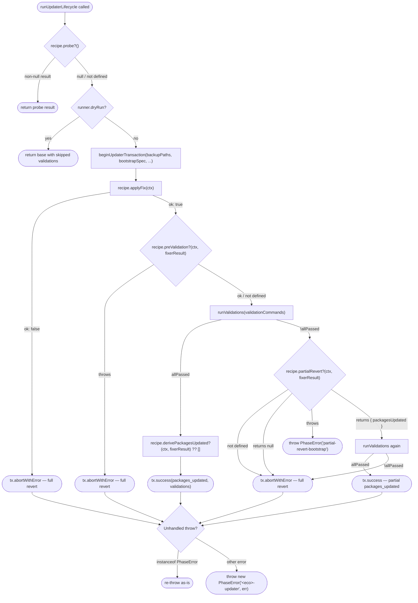

# Updater Internals — Transaction, Lifecycle, Environment Probe

How dependency updates apply safely: the transaction owns backup/revert, the lifecycle owns the shared sequence, the probe verifies the environment before any mutation.

## Updater Transaction (`beginUpdaterTransaction`)

`src/modules/ecosystem/utils/updater-transaction.ts` concentrates the duplicated revert/result-building boilerplate that previously lived in three updaters (`npm-updater.ts`, `composer-updater.ts`, `pip-updater.ts`).

**This module is no longer called directly by updaters.** It is invoked by `runUpdaterLifecycle()` (below), which orchestrates the full probe → fix → validate → revert sequence. Updaters supply an `UpdaterRecipe<T>` to the lifecycle function instead of calling `beginUpdaterTransaction` themselves.

The transaction is created with a `BootstrapSpec` (`{ binary, args, label }`) that describes how to reinstall dependencies during revert (e.g. `npm ci`, `composer install --no-interaction --no-scripts`, `pip install -r requirements.txt`). The transaction owns the full revert protocol internally: `restore → bootstrap → restore-byte-identical → warn-only dirty-tree check`.

```ts
const tx = await beginUpdaterTransaction({
  files: NPM_FILES,        // backed up at start (or adopt preExistingBackups)
  base,                    // pre-built success-shaped UpdateResultJson
  cwd,
  runner,
  bootstrapSpec: { binary: 'npm', args: ['ci'], label: 'npm ci' },
  preExistingBackups,      // optional — adopt caller-supplied backups (osv staging-fix)
});

// Happy path:
return tx.success({ packages_updated, validations: validationResult.entries });

// Failure path — transaction runs restore→bootstrap→restore revert internally:
return tx.abortWithError({
  error: 'Validations failed after npm update — changes reverted',
  validations: validationResult.entries,
});
```

**Contract:** `abortWithError` runs the revert protocol and lets bootstrap failures propagate. If `npm ci` (or `composer install`, `pip install`) fails during revert, the error throws — the lifecycle's outer `try/catch → PhaseError` wraps it. This surfaces ambiguous on-disk state rather than silently continuing.

**BootstrapSpec** is supplied once at transaction creation and is distinct from `ProbeSpec` (which drives the pre-flight environment check in the Ecosystem Environment Probe). Bootstrap drives revert only.

**Why this seam:** three updaters each repeated ~25 lines of "build skipped entries + base UpdateResultJson + outer error-result spread" before the deepening. A bug in revert correctness (e.g. the npm "double-restore after `npm ci` lockfile-format normalization" trick) had three places to be remembered. After the deepening, the result-shaping invariant lives in one 60-line module.

## Updater Lifecycle (`runUpdaterLifecycle`)

`src/modules/ecosystem/utils/updater-lifecycle.ts` is the generic skeleton shared by all three ecosystem updaters (npm, pip, composer). It owns the full sequence from pre-flight probe through fix, validation, partial revert, and final success or abort — eliminating the need for each updater to duplicate that orchestration.

Updaters no longer call `beginUpdaterTransaction` directly. Instead they define an `UpdaterRecipe<TFixerResult>` and pass it to `runUpdaterLifecycle()`, which drives the lifecycle and delegates low-level revert bookkeeping to the transaction.

### Lifecycle Flowchart



### `UpdaterRecipe<T>` Interface

```ts
interface UpdaterRecipe<TFixerResult = void> {
  agentName: string;          // e.g. 'npm-updater'
  ecosystemKey: string;       // e.g. 'npm', 'pip', 'composer'
  backupPaths: string[];      // files backed up at transaction start
  bootstrapSpec: BootstrapSpec; // how to reinstall deps during revert

  probe?(ctx): Promise<UpdateResultJson | null>;
  applyFix(ctx): Promise<FixResult<TFixerResult>>;
  preValidation?(ctx, fixerResult): Promise<void>;
  derivePackagesUpdated?(ctx, fixerResult): Promise<string[]>;
  deriveAuditFindings?(ctx, fixerResult): Promise<AuditFinding[] | undefined>;
  partialRevert?(ctx, fixerResult): Promise<{ packagesUpdated: string[] } | null>;
}
```

`FixResult<T>` is `{ ok: true; value: T } | { ok: false; error: string; validationStatus?: 'fail' | 'skipped' }`.

`deriveAuditFindings` is called after `derivePackagesUpdated` when present. Its result is forwarded to `UpdateResultJson.audit_findings` so the executive report can inject audit-discovered packages as synthetic `VulnerabilityEntry` objects.

### Recipe-to-Ecosystem Mapping

| Hook | npm | pip | composer |
|---|---|---|---|
| `probe` | — | — | `runEcosystemEnvironmentProbe` |
| `applyFix` | `FIXER_MAP[strategy]` dispatch | `pip install -U` | `composer update` + automationArgs |
| `preValidation` | `npm ci` (stream: true) | — | — |
| `partialRevert` | `fixerResult.partialRevert` → osv-only packages | — | — |
| `derivePackagesUpdated` | `mergeOsvFirstWins(osv, fixerResult)` | `mergeOsvFirstWins(osv, pipInstallResult)` | `mergeOsvFirstWins(osv, lockfileDiff)` |
| `deriveAuditFindings` | cross-ref `advisorFindings` × `packagesUpdated` (excludes OSV-known) | — | `fixerResult.auditAdvisories` mapped to `AuditFinding[]` |

### OSV-First-Wins Merge Strategy

All ecosystem updaters apply an **OSV-first-wins** merge when building `packages_updated`:

1. **OSV packages** (from `osvFixOutcome.packagesUpdated`) form the trusted base — they are verified against the staging lockfile before being written to disk.
2. **Fixer/audit packages** complement — only packages whose name does NOT already appear in the OSV set are added.
3. When both OSV and a fixer report the same package, the OSV version is kept (it was verified on disk).

This ensures the report always reflects OSV's verified results while still capturing additional fixes from ecosystem-specific tools (npm audit, pip install, composer update).

The shared helper `mergeOsvFirstWins(osvFixOutcome, fixerPackages)` implements this logic and is used by all three updaters.

**npm `deriveAuditFindings` data bridge:** the npm updater captures the pre-fix `package-lock.json` from `primaryBackups` before calling `runUpdaterLifecycle`. Inside `deriveAuditFindings` it cross-references the flat-mapped `advisorFindings` (from `npm audit --json` via the advisor phase) with `fixerResult.packagesUpdated`. Packages that are also present in `scanResult.ecosystems.npm.vulnerabilities` are excluded — only findings the OSV scan did not already classify are surfaced as `AuditFinding[]`. The `installedVersion` field is populated from the pre-fix lockfile. This gives npm the same reporting fidelity as Composer: audit-discovered packages appear in the executive report as synthetic vulnerability entries.

## Ecosystem Environment Probe

`src/modules/ecosystem/utils/environment-probe.ts` provides a pre-flight check that verifies an ecosystem CLI can run cleanly inside the active runner **before any mutation begins**.

```ts
interface ProbeSpec {
  binary: string;
  args: string[];
  cwd: string;
  errorPrefix: string;  // prefix for user-facing error messages
  label: string;        // display name for logging
}

type ProbeResult =
  | { ok: true }
  | { ok: false; exitCode: number; detail: string; error: string };
```

**Usage:** call `runEcosystemEnvironmentProbe(runner, spec)` at the start of an updater before taking any file snapshots or running fix commands. Currently adopted by `composer-updater.ts`. If the probe fails, the updater returns an `UpdateResultJson` with `status: 'error'` and a `'Composer environment mismatch: …'` prefix — no files are modified.

**Distinct from `BootstrapSpec`:** `BootstrapSpec` describes how to reinstall dependencies during a revert (inside the Updater Transaction). `ProbeSpec` is a read-only availability check — it never modifies files.
