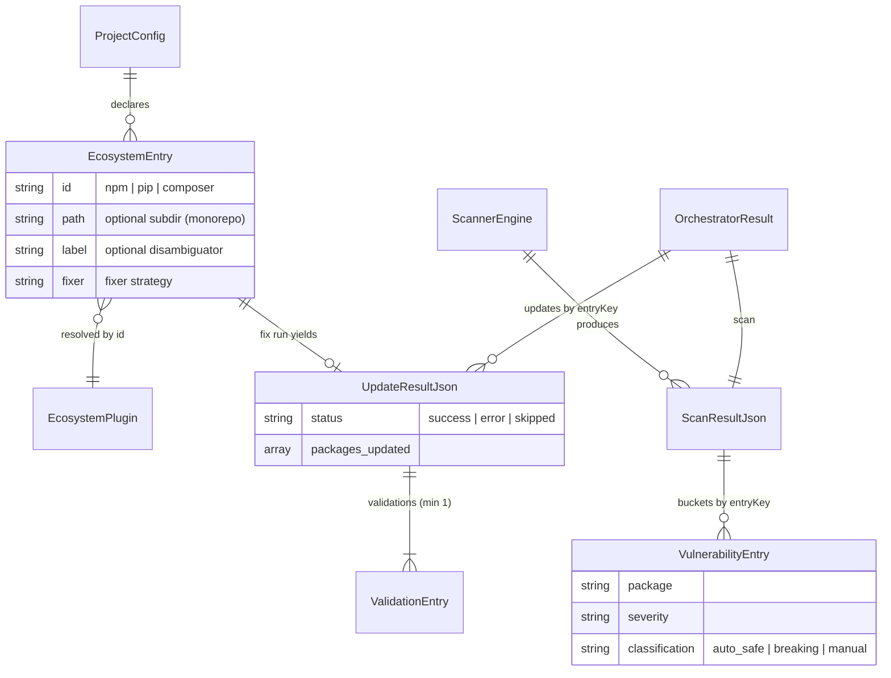

# Product Constitution

## Product

`security-scan` is a security-focused CLI that scans PHP (Composer), Node.js (npm), and Python (pip) projects for known CVEs via OSV Scanner, applies safe patch/minor updates automatically inside ephemeral Docker containers, and generates an executive HTML report. It delivers hands-off, evidence-backed dependency remediation to teams that maintain many client projects, and it is whitelabel-able via the brand system (`CLI_NAME`).

## Scope Boundaries

**In scope:**

- Vulnerability scanning of lockfile-based ecosystems (npm, pip, composer) with OSV as the primary engine.
- Automated application of safe (patch/minor, non-breaking) dependency updates, with transactional revert on failure.
- Post-update verification (residual OSV scan, project validation commands) and executive reporting (HTML, i18n en/pt-br).
- Ephemeral, hardened Docker execution of every ecosystem CLI ([ADR 0001](/adr/0001-docker-only-runtime.md), [ADR 0002](/adr/0002-threat-model-and-runtime-hardening.md)).
- Monorepo support: multiple entries per ecosystem via `path` + `label` config fields.

**Explicitly out of scope:**

- Running ecosystem CLIs on the host (local/auto runtime modes were removed — [ADR 0001](/adr/0001-docker-only-runtime.md)).
- Automatic installation of breaking (major) updates without explicit authorization.
- Source-code static analysis as a blocking concern (SonarQube is secondary/informational).
- Cloud upload of reports (Google Drive support was removed; local artifacts only).

## Data Model / Schema Foundation

Every stage downstream of the scan is keyed by `entryKey` (`<id>` or `<id>:<label>`). Contracts are frozen as Zod schemas in `src/core/gates/validator.ts` and documented in [/reference/json-schema-reference.md](/reference/json-schema-reference.md).

## Non-negotiables

- **OSV is always the primary engine.** Gate A reads from the OSV engine result regardless of registration order; primary-engine failure is fatal.
- **Secondary engines never block.** SonarQube (and any secondary) honors `on_failure: warn` by default; advisors never block the pipeline — their errors are swallowed.
- **Every phase output passes a Zod gate.** Gate A for scans, an Ecosystem Gate per update; gate failure is fatal for its scope and gates are never bypassed in tests.
- **`validations` is never empty.** The gate schema enforces `min(1)`; when tests are not run, a `skipped` entry is emitted.
- **Docker-only execution with a hardened boundary.** Ecosystem CLIs run in ephemeral containers (`--cap-drop=ALL`, `--security-opt=no-new-privileges`); `git`/`gh`/`open` are host-only. External data (branch names, package names) never passes through shell interpolation — `runArgs` over `run`.
- **The kill switch is honored.** `SECURITY_SCAN_NO_AUTO_FIX` skips all automated fixes and writes no files.
- **Updates are transactional.** Every updater runs inside the updater transaction (backup → apply → validate → revert protocol); an ambiguous on-disk state surfaces as an error, never silently.
- **No hardcoded brand strings.** All user-visible names derive from `src/infrastructure/brand.ts` (`CLI_NAME`).

## Amendment Log

## Amendment 1 — 2026-07-06: Initial ratification

Distilled from invariants already enforced in code and decided in [ADR 0001](/adr/0001-docker-only-runtime.md)–[ADR 0004](/adr/0004-ecosystem-runner-config-and-build-context-hardening.md); no new positions introduced. Recorded as part of the living-docs adoption ([ADR 0005](/adr/0005-adopt-living-docs-governance.md)).
